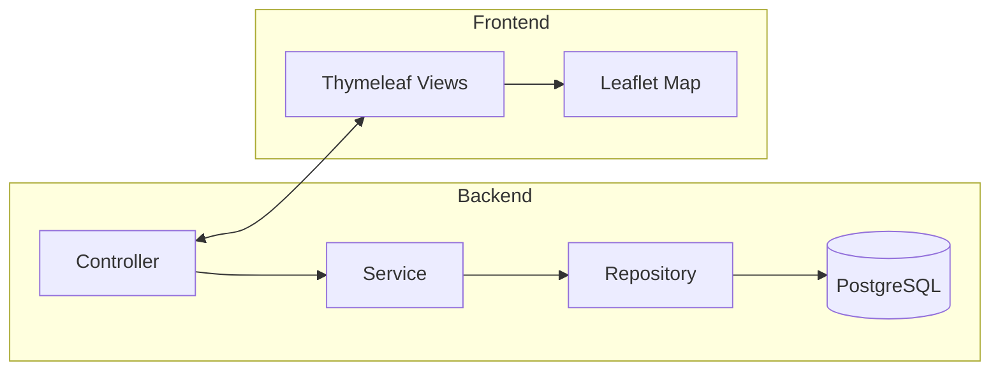
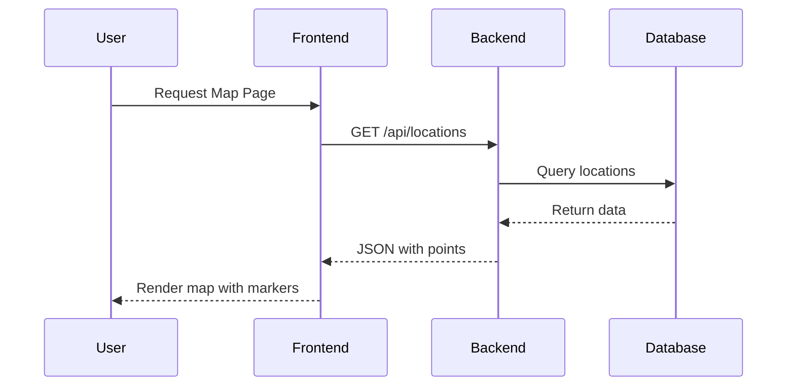

# GeoPoint Tracker

## Project Overview
GeoPoint Tracker is a sample geolocation platform designed to store and visualize geographic points of interest. The application exposes a RESTful backend built with **Java 11** and **Spring Boot**, a modern frontend rendered with **Thymeleaf** and **Leaflet** for interactive mapping, and persistent storage on **PostgreSQL**. Docker and Maven streamline building, running, and shipping the application.

## Features
- User registration and login
- Record geospatial locations with custom metadata
- Interactive map visualization using Leaflet
- REST API for CRUD operations on location data
- Role-based access control
- Dockerized deployment

## Technology Stack
| Technology   | Role / Purpose |
|--------------|----------------|
| **Java 11**  | Core language for the backend logic |
| **Spring Boot** | Main framework providing REST capabilities, security, and integration with PostgreSQL |
| **PostgreSQL** | Relational database storing user and location information |
| **JSF / Thymeleaf** | Server-side rendering of pages and forms |
| **Leaflet** | Library for map visualization on the frontend |
| **Maven** | Dependency management and build tool |
| **Docker / Docker Compose** | Containerization and orchestration |

## Architecture & Folder Structure
The project follows a layered architecture separating controllers, services, repositories, and views.



Typical folder tree:
```
GeoPoint-Tracker/
├── src/
│   ├── main/
│   │   ├── java/com/example/geopoint/
│   │   │   ├── controller/
│   │   │   ├── service/
│   │   │   └── repository/
│   │   └── resources/
│   │       ├── static/
│   │       └── templates/
│   └── test/
├── docker/
├── Dockerfile
├── docker-compose.yml
└── pom.xml
```

## Endpoints (API Reference)
| HTTP Method | Route | Description |
|-------------|-------|-------------|
| `GET` | `/api/locations` | List all locations |
| `GET` | `/api/locations/{id}` | Retrieve a single location |
| `POST` | `/api/locations` | Create a new location |
| `PUT` | `/api/locations/{id}` | Update an existing location |
| `DELETE` | `/api/locations/{id}` | Remove a location |

## Setup & Installation
### Prerequisites
- JDK 11+
- Maven 3+
- Docker & Docker Compose

### Environment Variables
Set these variables when running locally or in production:
- `SPRING_DATASOURCE_URL` – JDBC URL to the PostgreSQL instance
- `SPRING_DATASOURCE_USERNAME` – Database username
- `SPRING_DATASOURCE_PASSWORD` – Database password
- `SERVER_PORT` – Port for the web server (default `8080`)

### Local Setup
```bash
# Clone repository
git clone https://github.com/youruser/geopoint-tracker.git
cd geopoint-tracker

# Build project
mvn clean package

# Start PostgreSQL (if using Docker)
docker-compose up -d db

# Run application
java -jar target/geopoint-tracker.jar
```

### Docker / Docker Compose
```bash
# Build images and start services
docker-compose up --build

# Stop services
docker-compose down
```

## Running the Project
Common commands:
```bash
# Compile and package
mvn package

# Run tests
mvn test

# Execute the jar
java -jar target/geopoint-tracker.jar

# Build Docker image
docker build -t geopoint-tracker .

# Deploy with Docker Compose
docker-compose up -d
```

## Screenshots or Diagrams
Below is a sample sequence diagram showing interaction between frontend and backend.



## Contributing
1. Fork the repository and create a feature branch:
   ```bash
   git checkout -b feature/my-feature
   ```
2. Commit your changes following conventional commit messages.
3. Push the branch and open a Pull Request describing the changes.
4. Ensure new code is covered by tests and CI passes.
5. After review, your PR will be merged into `main`.

## License & Credits
This project is released under the MIT License. See the [LICENSE](LICENSE) file for details.

Credits to all open source libraries and contributors involved in making GeoPoint Tracker possible.
